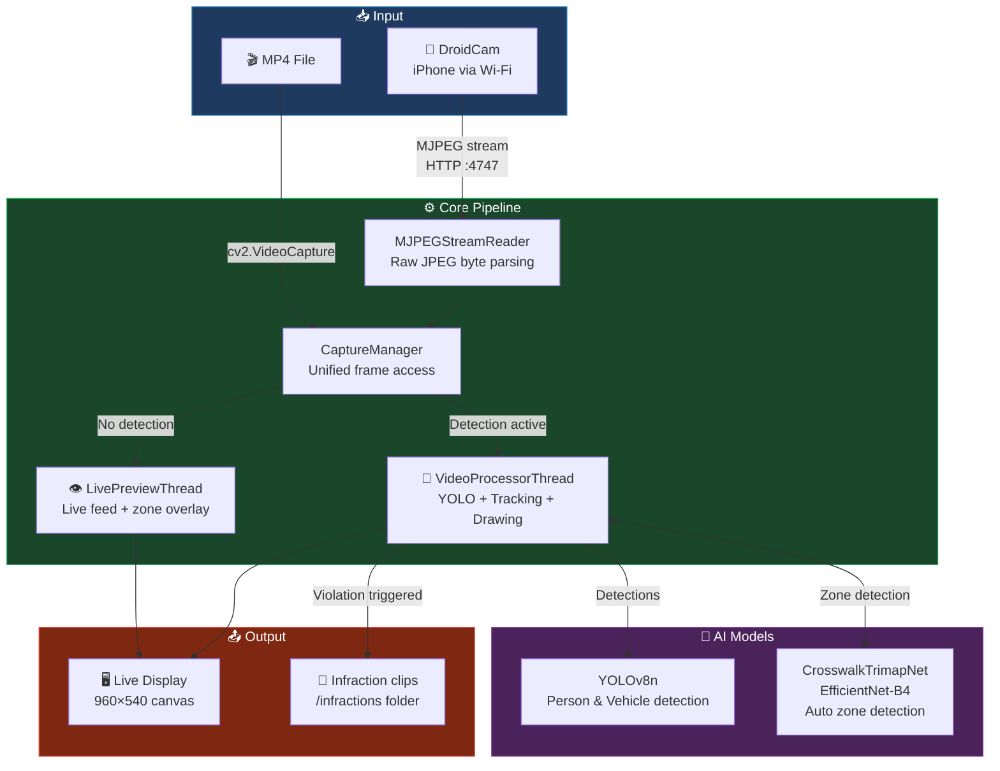

# SafeWalk AI - Intelligent Crosswalk Monitoring System

[](https://youtu.be/iGKjVSqxaao)

SafeWalk AI is an advanced, multi-threaded computer vision system designed to optimize urban road safety by automatically monitoring pedestrian crosswalks. Utilizing state-of-the-art deep learning architectures, the system detects pedestrians and vehicles in real-time, tracks individual entities across frames to eliminate double-counting, and flags traffic violations when a vehicle fails to yield the right-of-way to a pedestrian inside the designated zone.

---

## 🗺️ Architecture Overview



## ✨ Comprehensive Key Features

* **Real-Time Deep Learning Detection:** Integrates Ultralytics YOLOv8 (`yolov8n.pt`) to detect, categorize, and draw bounding boxes around pedestrians, cars, trucks, and buses with optimized confidence filtering.
* **High-Performance Multi-Threaded Architecture:** Divided into three decoupled, synchronized layers to ensure a stutter-free 640x480/960x540 UI rendering pipeline even under heavy inference loads:
  1. **Main GUI Thread (Tkinter):** Handles widget interaction, button states, calibration canvas inputs, and periodic frame polls.
  2. **Live Preview Thread:** Drives low-overhead raw video streaming and polygon overlay rendering when the AI model is idle.
  3. **Video Processor Thread:** Manages high-load sequential YOLO inferences, tracks vehicle coordinates, detects frame-by-frame motion, and triggers automated recording sessions.
* **Moving Camera Mode (Dashcam Integration):** Leverages a Lucas-Kanade Sparse Optical Flow algorithm to compute the background motion vectors of the camera. This allows the software to work dynamically from inside a moving car, automatically suspending monitoring while driving, and triggering an automated re-calibration sequence once the vehicle comes to a complete stop.
* **Automated DVR Infraction Recorder:** Features a continuous double-ended frame ring-buffer (`deque`). When a violation condition is met, the system instantly logs a high-resolution snapshot (`.jpg`) and kicks off an asynchronous worker thread to encode and compile a compiled video evidence clip (`.mp4`) containing the critical seconds *before* and *after* the infraction occurred.
* **De-duplicated Object Tracking:** Employs a spatial tracking algorithm based on Euclidean distance thresholds and frame-skipping grace intervals (`max_frames_missing`), guaranteeing that unique vehicles are assigned persistent IDs and counted exactly once per violation event.

---

## 🛠️ Tech Stack & Dependencies

* **Core Programming Language:** Python 3
* **Computer Vision Pipeline:** OpenCV (`cv2`) for video I/O, frame resizing, primitive graphics drawing, and Sparse Optical Flow tracking.
* **Object Detection Engine:** Ultralytics YOLOv8
* **Semantic Segmentation (Auto-Calibration):** PyTorch (`torch`, `torchvision`) paired with `segmentation-models-pytorch` executing an EfficientNet-B4 Trimap model to dynamically identify road markings.
* **Graphical User Interface:** Tkinter (including themed `ttk` widgets) for native desktop windows and asynchronous event handling.
* **Image Processing Wrapper:** Pillow (`PIL`) for thread-safe NumPy array to Tkinter PhotoImage conversions.
* **Mathematical Operations:** NumPy for multi-dimensional matrix operations, coordinate rounding, and mask indexing.

---
 
## 🧠 Auto-Calibration Model — CrosswalkTrimapNet
 
A custom trimap segmentation model built on **EfficientNet-B4** for vehicle-mounted crosswalk detection.
 
Rather than a binary mask, the model outputs a **3-class trimap** (background / interior / boundary), enabling more precise polygon fitting. Interior and boundary are merged at inference time (`trimap >= 1`) to form the final calibration region.
 
### Architecture
 
| Component | Role |
|---|---|
| EfficientNet-B4 backbone | Multi-scale feature extraction (ImageNet pretrained) |
| GatedLaplacianUnit + LaplacianFusion | Edge sharpening on skip connections and final output |
| CBAM + BoundaryAttentionModule | Region focus and boundary pixel weighting |
| 5-stage ConvTranspose2d decoder | Resolution recovery with skip concatenation |
 
### Training Data
 
None of the datasets included pre-built trimaps. Trimaps were generated from polygon annotations via erosion/dilation across all three datasets.
 
**Stage 1 — Base Training (5,355 images)**
 
| Dataset | Source | Selection | Final |
|---|---|---|---|
| Mapillary Vistas v2 | [HuggingFace](https://huggingface.co/datasets/candylion/mapillary-vistas-v2) | Extract crosswalk class → remove images where crosswalk < 5% of frame | 2,055 |
| FPVCrosswalk2025 | [Mendeley DOI: 10.17632/mcr2jwk5bp.1](https://data.mendeley.com/datasets/mcr2jwk5bp/1) | Used as-is | 3,300 |
 
**Stage 2 — Fine-Tuning (18,227 images)**
 
| Dataset | Source | Selection | Final |
|---|---|---|---|
| AIHub Metropolitan Dashcam | [AIHub datasetkey 197](https://aihub.or.kr/aihubdata/data/view.do?dataSetSn=197) | Extract crosswalk class (87,086) → daytime only (60,197) → remove images where crosswalk < 3% of frame | 18,227 |
 
### Results
 
| Metric | Score |
|---|---|
| mIoU | 0.7929 |
| Interior Recall | 0.9563 |
| **CW-FG IoU** | **0.9357** |
 
> CW-FG IoU measures detection accuracy on the merged interior + boundary region — the metric most relevant to calibration quality.
 
---

## 🖥️ Graphical User Interface & Button Control Guide

The interface is divided into a **Left-side Control Panel** managing application states and a **Right-side Interactive Canvas** rendering live imagery.

### 1. "Open video / camera" Button (`btn_open`)
* **What it does:** Initiates the media input stream selection process.
* **Under the Hood:** Triggers a native dialog asking the user to choose between an IP camera feed or a local file.
  * **If Live Feed (DroidCam):** Prompts for the phone's Wi-Fi IP address and sequentially tests common mobile MJPEG stream endpoints (`/video`, `/mjpegfeed`, `/mjpeg.html`) via persistent HTTP requests. It handles automatic reconnection delays if the network connection drops.
  * **If Local File:** Opens an OS file explorer filtered for `.mp4`, `.avi`, `.mov`, and `.mkv` files, initializing an internal `cv2.VideoCapture` object and reading spatial resolution parameters.

### 2. "Manual Calibration" Button (`btn_calib`)
* **What it does:** Switches the application state to `CALIBRATING` and prepares the canvas to receive manual region-of-interest (ROI) boundary points.
* **Under the Hood:** Clears previous geometric overlays and unlocks click events on the main canvas. The user must click **4 precise corners** corresponding to the crosswalk surface area:
  * As clicks occur, red circular nodes and cyan alpha lines are drawn to outline the polygon shape.
  * Upon the 4th click, the pixel coordinates are normalized into percentage values relative to the canvas dimensions (0-100%) and saved permanently to a local `settings.json` file. This ensures that if the video resolution alters mid-stream (such as rotating a mobile device), the monitoring polygon automatically rescales to the new dimensions without warping.

### 3. "Auto Calibration" Button (`btn_auto_calib`)
* **What it does:** Uses Deep Learning to completely automate the crosswalk boundary selection.
* **Under the Hood:** Extracts a single frame snapshot from the active stream and passes it through an EfficientNet-B4 Trimap semantic segmentation architecture. The network outputs a raw mask highlighting the pedestrian crossing paint markings, computes a convex hull polygon boundary, normalizes the vertices to percentage structures, pushes them directly to the active preview thread, and updates `settings.json`.

### 4. "Moving Camera Mode" Checkbox (`chk_moving`)
* **What it does:** Toggles between a fixed surveillance infrastructure behavior and an on-board moving vehicle (dashcam) behavior.
* **Under the Hood:** Clicking this checkbox toggles an internal boolean flag.
  * **When Checked:** Instantly disables the manual and auto calibration buttons. The system knows that a static boundary is invalid because the vehicle is moving. Instead, it spins up the `CameraMotionDetector` which calculates frame-wide optical displacement. To prevent the car's own dashboard or hood from distorting motion calculations, it applies an upper 70% Region of Interest (ROI) mask to the tracking field.
  * **State Transitions:** While the median displacement vector exceeds `MOTION_THRESHOLD`, the interface displays `Ego-car Status: Moving` and tracking is idle. Once the car remains stationary for at least `STOP_FRAMES_REQUIRED`, the state cycles to `Calibrating`, fires an asynchronous auto-calibration background thread to map the new forward crosswalk, and switches to `Stopped & Monitoring` once completed.

### 5. "Start Detection" Button (`btn_run`)
* **What it does:** Loads the underlying AI models and commences real-time traffic rule compliance monitoring.
* **Under the Hood:** If not previously instantiated, it reads `config.py` parameters and instantiates the YOLOv8 model architecture. It then terminates any low-overhead preview processes, purges outstanding queue buffers, resets video markers back to the zero frame, resets session counters, and spins up the multi-threaded `VideoProcessorThread`. The processor throttles processing to `YOLO_MAX_FPS` to avoid overloading hardware while executing ray-casting algorithms to determine if any vehicle bounding boxes intersect with pedestrian coordinates within the polygon space.

### 6. "Stop Detection" Button (`btn_stop`)
* **What it does:** Halts active neural net processing and smoothly reverts the application back to a safe idle/preview state.
* **Under the Hood:** Sets an asynchronous thread stop flag (`_processor_stop.set()`), waits for the processing loop to safely exit, flushes outstanding frames from the display queue, and re-engages the lightweight `LivePreviewThread` to maintain an active camera view without consuming heavy processing power.

### 7. "View Recordings" Button (`btn_recordings`)
* **What it does:** Instantly opens the local destination folder containing all captured images and videos of traffic violations.
* **Under the Hood:** Interrogates the local runtime environment using Python’s `sys.platform` property and triggers a native platform shell invocation pointing to the `infractions` directory (utilizing `os.startfile` on Windows, a shell `open` command on macOS, or an `xdg-open` process on Linux distributions).

### 8. Diagnostic & State Labels
* **Violations Recorded Label:** Dynamically counts and displays the integer value of verified infraction events logged during the active monitoring session.
* **Stream Frames Label:** Provides a live health metric displaying the raw number of frames processed by the MJPEG stream engine, color-coding green during operational health and red during network disconnection.
* **Status Label:** A persistent, contextual message bar notifying the user of exact technical procedures occurring in the background (e.g., `"Connecting to DroidCam..."`, `"Loading AI model..."`, `"Detection in progress"`).

---

## ⚙️ Configuration Parameters (`config.py`)

You can fully customize system performance and sensitivity metrics by tweaking `config.py` parameters:

```python
# YOLO Confidence & Models
YOLO_MODEL = "yolov8n.pt"          # Model weight variant selection
CONFIDENCE_THRESHOLD = 0.5        # Minimum confidence score to register an object

# Motion Detection Settings (Moving Camera Mode)
MOTION_THRESHOLD = 1.5            # Lower value increases sensitivity to subtle movements
STOP_FRAMES_REQUIRED = 25         # Consecutive frames needed to confirm vehicle is stopped
MOVE_FRAMES_REQUIRED = 8          # Consecutive frames needed to confirm vehicle is moving

# Automated DVR Buffer Window Settings
INFRACTIONS_DIR = "infractions"   # Local directory for violation records
VIDEO_BUFFER_BEFORE_SEC = 2.0     # Pre-infraction footage duration cached in ring-buffer
VIDEO_DURATION_AFTER_SEC = 3.0    # Post-infraction footage duration recorded after trigger
```

---

## 🚀 Detailed Installation & Execution Guide

### 1. Clone Project Repository
```bash
git clone https://github.com/Kylian27/Safewalk-AI
cd Safewalk-AI
```

### 2. Configure Virtual Environment Environment
```bash
# Windows Environment Setup
python3 -m venv venv
venv\Scripts\activate

# Linux / MacOS Environment Setup
python3 -m venv venv
source venv/bin/activate
```

**Note:** Depending on your installation, you may need to use `python` instead of `python3`.

### 3. Install Dependencies
```bash
pip install -r requirements.txt
```

### 4. Weights Placement Verification
Ensure that your fine-tuned auto-calibration weights (`base_best.pt`) are properly located inside the `auto_calibrate/models/` directory. The standard YOLOv8 weight architecture (`yolov8n.pt`) will automatically handle its download sequence on its initial startup execution.

### 5. Run Application
```bash
python3 main.py
```

**Note:** Depending on your installation, you may need to use `python` instead of `python3`.

---

## 👥 Project Authors
Samy NASSET, Kylian LABRADOR, Yann MALARET and 윤치호
